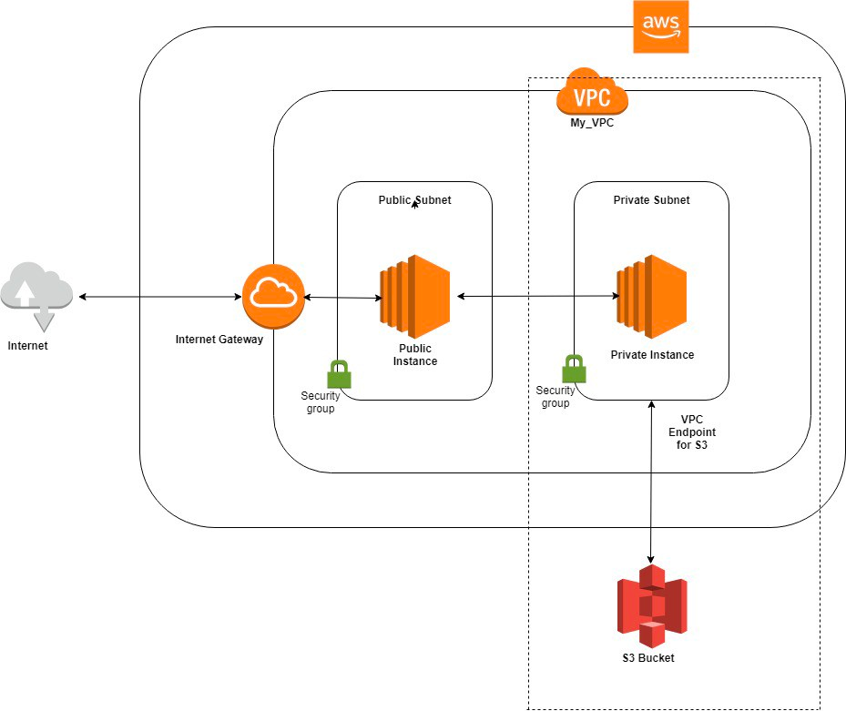

# 개요
- VPC Endpoint for Amazon S3
- private link 구축

# 인프라 구축
- `terraform init`
- `terraform apply -auto-approve`

#테스트
인프라 구축이 성공적으로 완료 시, 테스트 케이스
- `ssh -i ~/.ssh/<pem 키> ec2-user@<PRODUCER_PUBLIC_IP>` _(public 서버에서 만 private 서버로 접속 가능)_
- `ssh -i ~/.ssh/<pem 키> ec2-user@<PRODUCER_PRIVATE_IP>` _(privatelink 를 통해 s3 경로가 존재하는 private 서버로 접속 가능)_
- `aws s3 ls s3://<버킷이름>`
- `touch file.txt`
- `aws s3 cp file.txt s3://<버킷이름>/`
- `aws s3 ls s3://privaelink-202907271837`
  명령어 및 사용방법: https://docs.aws.amazon.com/cli/latest/userguide/cli-services-s3-commands.html